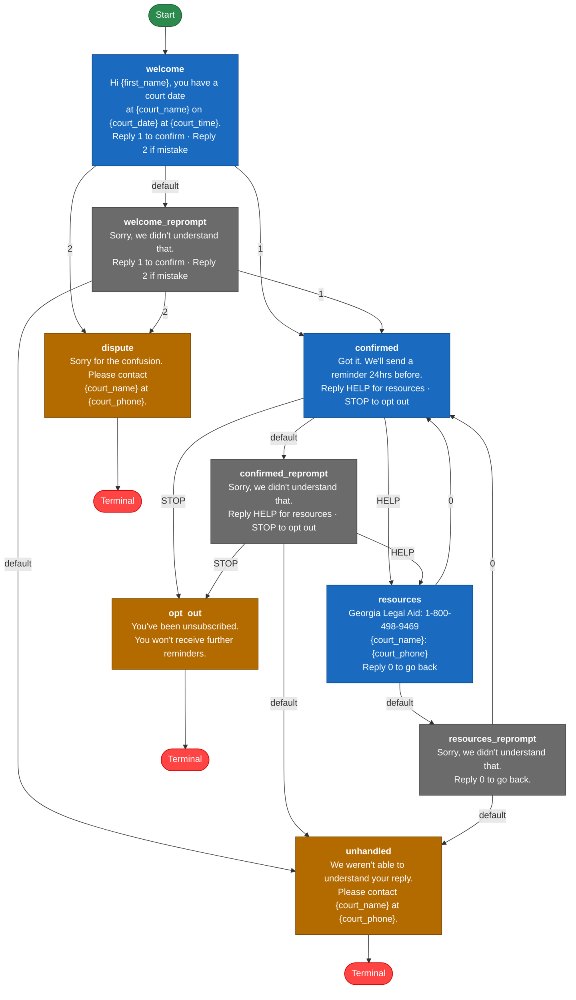

# Court Reminder Flow: court_reminder_v1

## Color Key

```mermaid
flowchart LR
    s([Start]):::start
    h["Happy path step"]:::happy
    r["Reprompt step"]:::reprompt
    u["Unhappy / exit path step"]:::unhappy
    t([Terminal]):::terminal

    s ~~~ h ~~~ r ~~~ u ~~~ t

    classDef start fill:#2d8a4e,color:#fff,stroke:#1a5e33
    classDef happy fill:#1a6bbf,color:#fff,stroke:#0d4a8a
    classDef reprompt fill:#6b6b6b,color:#fff,stroke:#444
    classDef unhappy fill:#b36b00,color:#fff,stroke:#7a4900
    classDef terminal fill:#ff4444,color:#fff,stroke:#cc0000
```

## Flow Diagram

```mermaid
flowchart TD
    START([Start]):::start

    START --> welcome

    welcome["<b>welcome</b></br>Hi {first_name}, you have a court date</br>at {court_name} on {court_date} at {court_time}.</br>Reply 1 to confirm · Reply 2 if mistake"]:::happy
    welcome -->|"1"| confirmed
    welcome -->|"2"| dispute
    welcome -->|default| welcome_reprompt

    welcome_reprompt["<b>welcome_reprompt</b></br>Sorry, we didn't understand that.</br>Reply 1 to confirm · Reply 2 if mistake"]:::reprompt
    welcome_reprompt -->|"1"| confirmed
    welcome_reprompt -->|"2"| dispute
    welcome_reprompt -->|default| unhandled

    confirmed["<b>confirmed</b></br>Got it. We'll send a reminder 24hrs before.</br>Reply HELP for resources · STOP to opt out"]:::happy
    confirmed -->|"HELP"| resources
    confirmed -->|"STOP"| opt_out
    confirmed -->|default| confirmed_reprompt

    confirmed_reprompt["<b>confirmed_reprompt</b></br>Sorry, we didn't understand that.</br>Reply HELP for resources · STOP to opt out"]:::reprompt
    confirmed_reprompt -->|"HELP"| resources
    confirmed_reprompt -->|"STOP"| opt_out
    confirmed_reprompt -->|default| unhandled

    dispute["<b>dispute</b></br>Sorry for the confusion. Please contact</br>{court_name} at {court_phone}."]:::unhappy
    dispute --> TERM_DISPUTE([Terminal]):::terminal

    resources["<b>resources</b></br>Georgia Legal Aid: 1-800-498-9469</br>{court_name}: {court_phone}</br>Reply 0 to go back"]:::happy
    resources -->|"0"| confirmed
    resources -->|default| resources_reprompt

    resources_reprompt["<b>resources_reprompt</b></br>Sorry, we didn't understand that.</br>Reply 0 to go back."]:::reprompt
    resources_reprompt -->|"0"| confirmed
    resources_reprompt -->|default| unhandled

    opt_out["<b>opt_out</b></br>You've been unsubscribed.</br>You won't receive further reminders."]:::unhappy
    opt_out --> TERM_OPT([Terminal]):::terminal

    unhandled["<b>unhandled</b></br>We weren't able to understand your reply.</br>Please contact {court_name} at {court_phone}."]:::unhappy
    unhandled --> TERM_UNHANDLED([Terminal]):::terminal

    classDef start fill:#2d8a4e,color:#fff,stroke:#1a5e33
    classDef happy fill:#1a6bbf,color:#fff,stroke:#0d4a8a
    classDef reprompt fill:#6b6b6b,color:#fff,stroke:#444
    classDef unhappy fill:#b36b00,color:#fff,stroke:#7a4900
    classDef terminal fill:#ff4444,color:#fff,stroke:#cc0000
```